# 🔥 stream-climax-detector

**Real-time hype peak detector for Kick.com live chat.**

Connects to any Kick channel via WebSocket, computes 7 statistical features
over 5-second windows, and detects hype spikes using adaptive z-score.
Live Streamlit dashboard with timeline and peak log.

[](https://github.com/soyDCAR/stream-climax-detector/actions/workflows/ci.yml)


---

## Architecture

```mermaid
flowchart LR
    A[Kick.com\nPusher WebSocket] -->|raw messages| B[IRC Consumer\nconsumer.py]
    B -->|asyncio.Queue| C[Feature Aggregator\naggregator.py\n5s windows]
    C -->|FeatureWindow| D[Climax Scorer\nscorer.py\nz-score + cooldown]
    D -->|ClimaxResult| E[(SQLite DB\nclimax.db)]
    E -->|fetch_recent| F[Streamlit Dashboard\ndashboard.py\nauto-refresh 2s]

    style A fill:#1a1d27,color:#4fc3f7,stroke:#2e3350
    style B fill:#1a1d27,color:#43d9a2,stroke:#2e3350
    style C fill:#1a1d27,color:#43d9a2,stroke:#2e3350
    style D fill:#1a1d27,color:#7c6af7,stroke:#2e3350
    style E fill:#1a1d27,color:#f7c948,stroke:#2e3350
    style F fill:#1a1d27,color:#7c6af7,stroke:#2e3350
```



**Pipeline:**
1. **Consumer** connects to Kick's Pusher WebSocket (`chatrooms.{id}.v2`), resolves `chatroom_id` via REST API or manual input, and puts parsed messages into an `asyncio.Queue`.
2. **Aggregator** drains the queue every 5 seconds, computes 7 features, and passes a `FeatureWindow` to the scorer.
3. **Scorer** calculates a weighted sum → normalizes via adaptive z-score over 10-minute history → maps to `[0, 100]` via sigmoid → fires a peak event if `z ≥ 2.0` and cooldown (30s) has elapsed.
4. **Storage** persists every `ClimaxResult` to SQLite with WAL mode for concurrent read/write.
5. **Dashboard** auto-refreshes every 2s via `st.fragment`, reads from SQLite, and displays the live timeline + peaks table. The consumer runs as a background thread managed from the sidebar — no separate process needed.

---

## Features

| Feature | Formula | Signal |
|---------|---------|--------|
| `msg_rate` | msgs / window_seconds | Chat velocity |
| `unique_users` | len(set(usernames)) | Participation breadth |
| `emote_ratio` | emote_tokens / total_tokens | Collective reaction |
| `caps_ratio` | caps_letters / total_letters | Emotional intensity |
| `avg_msg_length` | sum(len) / n | Information density |
| `exclamation_ratio` | msgs_with_! / n | Excitement |
| `link_ratio` | msgs_with_url / n | Spam signal (negative weight) |

---

## Scoring

```
raw_score  =  Σ (weight_i × normalize(feature_i))  × 100
z_score    =  (raw_score - μ_history) / σ_history
climax_score = sigmoid(z_score) × 100

peak detected  iff  z ≥ 2.0  AND  raw_score ≥ 10  AND  cooldown elapsed
```

The z-score adapts to the channel's baseline — a spike of 80 msg/s means
something very different on a 5 msg/s channel vs. a 200 msg/s channel.

---

## Quickstart

### Prerequisites

- Python 3.11
- [uv](https://docs.astral.sh/uv/) (`pip install uv`)
- Docker (recommended)

### Docker (recommended)

```bash
git clone https://github.com/soyDCAR/stream-climax-detector
cd stream-climax-detector

docker build -t stream-climax-detector .
docker run -p 8501:7860 -e TZ=America/Bogota stream-climax-detector
```

Open [http://localhost:8501](http://localhost:8501).

In the sidebar:
1. Enter the channel name (e.g. `chanty`)
2. Enter the Chatroom ID — find it at `kick.com/api/v2/channels/{channel}` → `chatroom.id`
3. Press **▶ Conectar**

> **Why the Chatroom ID?** Kick's REST API is protected by Cloudflare and blocks server/container requests.
> The Chatroom ID lets the consumer skip the REST call and connect directly via WebSocket.

### Local (without Docker)

```bash
git clone https://github.com/soyDCAR/stream-climax-detector
cd stream-climax-detector

uv venv --python 3.11
uv pip install -e ".[dev]"

streamlit run src/climax/dashboard.py
```

The scorer needs ~50s of data to warm up its z-score baseline.

---

## Docker

```bash
# Build
docker build -t stream-climax-detector .

# Run (consumer + dashboard in one container)
docker run -p 8501:7860 -e TZ=America/Bogota stream-climax-detector
```

Set `TZ` to your local timezone (e.g. `America/Bogota`, `Europe/Madrid`, `America/Mexico_City`) so the timeline X-axis shows your local time instead of UTC.

---

## Tests

```bash
pytest tests/ -v
# 43 tests · aggregator (13) · scorer (18) · storage (12)
```

---

## Project Structure

```
stream-climax-detector/
├── src/climax/
│   ├── config.py       # .env loader via os.environ
│   ├── consumer.py     # Kick WebSocket consumer (asyncio)
│   ├── aggregator.py   # 5s sliding window + 7 features
│   ├── scorer.py       # weighted sum + z-score + sigmoid
│   ├── storage.py      # SQLite persistence (WAL mode)
│   └── dashboard.py    # Streamlit live dashboard
├── tests/              # 43 pytest tests
├── scripts/
│   └── run_consumer.py # entrypoint: consumer + aggregator + scorer
├── .github/workflows/
│   └── ci.yml          # lint + format + tests on push/PR
├── Dockerfile          # multi-stage, UID 1000, port 7860
└── pyproject.toml      # deps + ruff + black + pytest config
```

---

## Stack

`Python 3.11` · `asyncio` · `websockets` · `aiohttp` · `numpy` · `structlog` · `streamlit` · `sqlite3` · `pytest` · `ruff` · `black` · `uv` · `Docker` · `GitHub Actions`

---

## Roadmap

- **v0.1** — Chat features + z-score scorer + Streamlit dashboard ✅
- **v0.2** — Dynamic channel switching from UI + Cloudflare-bypass via Chatroom ID ✅
- **v0.3** — Audio features (stream audio via yt-dlp + librosa RMS/spectral flux)
- **v0.4** — Video features (frame diff + scene change detection via OpenCV)
- **v1.0** — Multimodal fusion model + HF dataset export

---

## Author

**Dilan Acosta** · [@soyDCAR](https://github.com/soyDCAR)
Sound Engineer → ML Software Engineer
